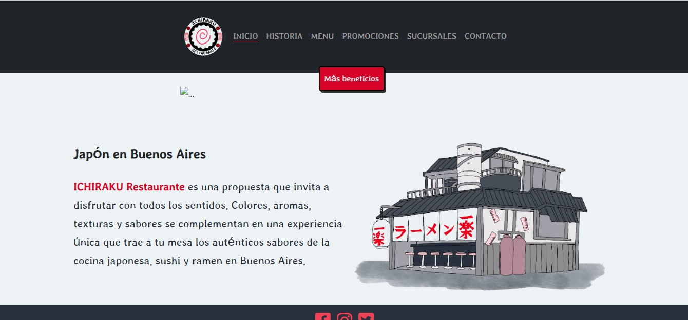

# ICHIRAKU Restaurante

Trabajo práctico Frontend del curso FullStack - Desarrollo Web (JavaScript/Node.JS) del programa Codo a Codo.

## Screenshot 📷

## Construido con 🛠️

* [HTML](https://developer.mozilla.org/es/docs/Web/HTML)
* [CSS](https://developer.mozilla.org/es/docs/Web/CSS)
* [JavaScript](https://developer.mozilla.org/es/docs/Learn/JavaScript)

## Autores ✒️

* **Luciano Rodríguez** - *Diseño y Maquetación* - [luckidetrenque](https://github.com/luckidetrenque)
* **Nicolás Rugna** - *Diseño y Maquetación*
* **Belén Seijas** - *Boceto e Ilustración* - [siluerdo](https://cafecito.app/siluerdo)

## Licencia 📄

Este proyecto está bajo la Licencia (GPL-3.0) - mira el archivo [LICENSE.md](LICENSE.md) para detalles
